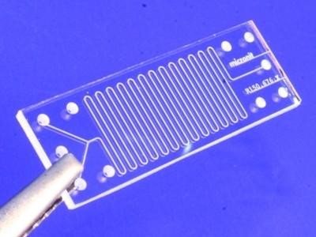

# heading top

also heading top
===

## heading 2

also heading 2
---

This is some text

> this is quoted text

     $ if you indent now its code

### heading 3

#### heading 4

* bullets
* yay

------------------------------

1. one
1. two
1. three

You can make links too. For example checkout the markdown dingus [here](http://daringfireball.net/projects/markdown/dingus). Also checkout GitHub flavored markdown [here](https://help.github.com/articles/github-flavored-markdown/)

images
-------

images from the folder:

images from the web:
![] (http://upload.wikimedia.org/wikipedia/commons/0/07/Glass-microreactor-chip-micronit.jpg)

you can use html to scale the image more easily:

you can make to do lists
------
- [ ] this
- [ ] that
 - [ ] that other thing
 - [x] this already done

